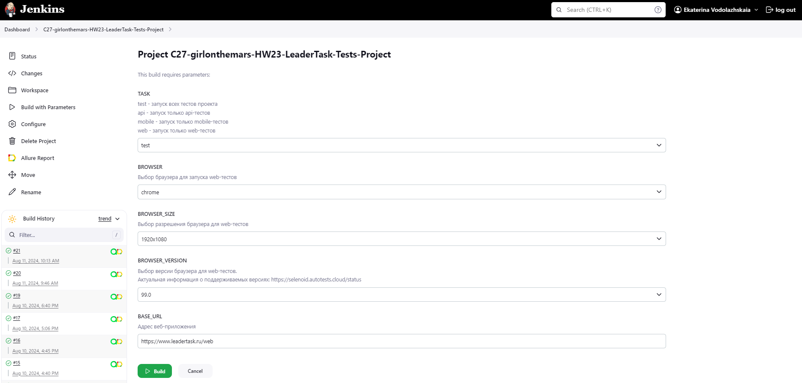

# Проект по автоматизации тестирования для компании [](https://www.leadertask.ru/)
> LeaderTask — сервис для для планирования и работы в команде. Позволяет составлять списки дел на день/неделю/месяц, раздавать поручения и контролировать исполнение, а также управлять проектами.
---
## :scroll: Содержание:
+ [Особенности проекта](#особенности-проекта)
+ [Используемый стек](#computer-используемый-стек)
+ [Реализованные проверки](#ballot_box_with_check-реализованные-проверки)
+ [Запуск тестов](#запуск-тестов)
    + [Локальный запуск тестов](#локальный-запуск-тестов)
    + [Удаленный запуск тестов на Selenoid и BrowserStack](#удаленный-запуск-тестов-на-Selenoid-и-BrowserStack)
+ [Сборка в Jenkins](#-сборка-в-jenkins)
+ [Интеграция с Allure Report](#-интеграция-с-allure-report)
+ [Интеграция с Allure TestOps](#-интеграция-с-allure-testops)
+ [Интеграция с Jira](#-интеграция-с-jira)
+ [Уведомления в Telegram с использованием бота](#-уведомления-в-telegram-с-использованием-бота)
+ [Видео примера запуска тестов в Selenoid](#-видео-примера-запуска-тестов-в-selenoid)
+ [Видео примера запуска тестов в BrowserStack](#-видео-примера-запуска-тестов-в-browserstack)
---
## Особенности проекта
- Проект состоит из UI-тестов, API и мобильных тестов для Android
- В данном проекте автотесты написаны на языке `Java`
- В качестве сборщика используется `Gradle`
- Используются фреймворки `JUnit 5` и `Selenide`
- Используется технология `Owner` для придания тестам гибкости и легкости конфигурации
- Используется `Faker` для генерации данных
- Используется `Lombok` для моделей в API тестах
- Реальзовано собственное расширение `@WithLogin` для предварительной авторизации новым пользователем
- При прогоне UI тестов браузер запускается в `Selenoid`
- Для запуска мобильных тестов удаленно используется `Browserstack`
- Для запуска мобильных тестов локально на эмуляторе или реальном устройстве используются `Appium` и `Android Studio`
- Реализована возможность запуска проектов с помощью `Jenkins`
- Реализована интеграция с `Jira` и `Allure TestOps`
- Настроена отправка уведомлений о результатах прохождения в `Telegram`
- По завершению прохождения автотестов генерируется `Allure` отчет
---
## :computer: Используемый стек
<p align="center">
<a href="https://www.jetbrains.com/idea/"></a> 
<a href="https://www.java.com/"></a>
<a href="https://gradle.org/"></a> 
<a href="https://selenide.org/"></a> 
<a href="https://aerokube.com/selenoid/"></a>
<a href="https://rest-assured.io"></a>
<a href="https://github.com/allure-framework/allure2"></a>
<a href="https://qameta.io"></a>
<a href="https://junit.org/junit5/"></a> 
<a href="https://github.com/"></a> 
<a href="https://www.jenkins.io/"></a> 
<a href="https://telegram.org/"></a>  
<a href="https://app-automate.browserstack.com/"></a>  
<a href="https://developer.android.com/studio"></a>   
<a href="https://appium.io"></a>  
<a href="https://www.atlassian.com/software/jira"></a>  
</p>   

---
## :ballot_box_with_check: Реализованные проверки:

### Web
- [x] Проверка добавления в проект сотрудника
- [x] Проверка добавления в проект задачи
- [x] Проверка удаления проекта
- [x] Проверка отмены удаления проекта
- [x] Проверка создания подпроекта
- [x] Проверка изменения имени пользователя в профиле
- [x] Проверка невозможности задания пустого имени пользователя
- [x] Проверка изменения номера телефона пользователя в профиле
- [x] Проверка невозможности задания некорректного номера телефона пользователя
- [x] Проверка переключения между разделами профиля

### Api
- [x] Проверка успешной авторизации
- [x] Проверка невозможности авторизации без пароля
- [x] Проверка невозможности авторизации без email
- [x] Проверка невозможности авторизации с некорректным паролем
- [x] Проверка невозможности авторизации с некорректным email
- [x] Проверка невозможности авторизации без атрибута system
- [x] Проверка невозможности авторизации без атрибута type_device
- [x] Проверка использования метода GET в случае, когда он не предусмотрен
- [x] Проверка успешного создания проекта с заполнением обязательных атрибутов
- [x] Проверка невозможности создания проекта без названия
- [x] Проверка невозможности создания проекта без атрибута uid
- [x] Проверка невозможности создания проекта без атрибута email_creator
- [x] Проверка использования метода DELETE в случае, когда он не предусмотрен

### Mobile
- [x] Проверка успешной авторизации
- [x] Проверка попытки авторизации с новым email и перехода к регистрации
- [x] Проверка отмены авторизации и возврата на начальный экран
---
## Запуск тестов

### Допустимые комбинации


### Локальный запуск тестов

> Для запуска мобильных тестов на своем устройстве необходимо заменить параметры в файле real.properties  
> Для запуска мобильных тестов на своем устройстве необходимо изменить параметры в файле emulator.properties

Запуск всех тестов
```
gradle clean test -DbrowserHost=local -DdeviceHost=real
```
Запуск Web тестов
```
gradle clean web -DbrowserHost=local
```

Если требуется передать параметры отличные отличные от заданных в `local.properties`, можно передать свои параметры в переменных при запуске:

- `browser` – браузер, в котором будут выполняться тесты
- `browserSize` – размер окна браузера, в котором будут выполняться тесты
- `browserVersion` – версия браузера, в котором будут выполняться тесты
- `baseUrl` - адрес веб-приложения
 ```
gradle clean test 
-DbrowserHost=local
-Dbrowser=chrome
-DbrowserSize=1920x1080
-DbrowserVersion=120.0
-DbaseUrl=https://www.leadertask.ru/web
```
Запуск API тестов
```
gradle clean api
```
Запуск мобильных тестов на реальном устройстве
```
gradle clean mobile -DdeviceHost=real
```
Запуск мобильных тестов на эмуляторе Android Studio
```
gradle clean mobile -DdeviceHost=emulation
```

### Удаленный запуск тестов на Selenoid и BrowserStack
> В проекте запуск Web тестов на Selenoid и мобильных тестов на BrowserStack установлен по умолчанию

Запуск всех тестов
```
gradle clean test
```
Запуск Web тестов на Selenoid
```
gradle clean web 
```
или
```
gradle clean web -DbrowserHost=remote
```

Если требуется передать параметры, отличные от заданных в `remote.properties`, можно передать свои параметры в переменных при запуске:  

- `browser` – браузер, в котором будут выполняться тесты
- `browserVersion` – версия браузера, в которой будут выполняться тесты
- `browserSize` – размер окна браузера, в котором будут выполняться тесты
- `baseUrl` - адрес веб-приложения
```
gradle clean test 
-Dbrowser=chrome
-DbrowserVersion=99.0
-DbrowserSize=1920x1080
-DbaseUrl=https://www.leadertask.ru/web
```
Запуск мобильных тестов на BrowserStack
```
gradle clean mobile 
```
или
```
gradle clean mobile -DdeviceHost=browserstack
```
---

##  Сборка в [Jenkins](https://jenkins.autotests.cloud/job/C27-girlonthemars-HW23-LeaderTask-Tests-Project/)

* <code>TASK</code> – название запускаемой задачи. По умолчанию - <code>test</code>.
* <code>BROWSER</code> – браузер, в котором будут выполняться тесты. По умолчанию - <code>chrome</code>.
* <code>BROWSER_VERSION</code> – версия браузера, в которой будут выполняться тесты. По умолчанию - <code>99.0</code>.
* <code>BROWSER_SIZE</code> – размер окна браузера, в котором будут выполняться тесты. По умолчанию - <code>1920x1080</code>.

***Параметры запуска:***
```
clean ${TASK}
-"Dbrowser=${BROWSER}"
-"DbrowserSize=${BROWSER_SIZE}"
-"DbrowserVersion=${BROWSER_VERSION}"
-"DbaseUrl=${BASE_URL}
```
Для запуска сборки необходимо перейти в раздел <code>Собрать с параметрами</code>, задать параметры и нажать кнопку <code>Собрать</code>.

<p align="center">

</p>

После выполнения сборки, в блоке <code>История сборок</code> напротив номера сборки появятся значок <code>Allure Report</code>, при клике на который открывается страница со сформированным html-отчетом и тестовой документацией соответственно,
а так же значок <code>Allure TestOps</code> при клике на который открывается страница проекта в <code>Allure TestOps</code>.

<p align="center">

</p>

---
##  Интеграция с [Allure Report](https://jenkins.autotests.cloud/job/C27-girlonthemars-HW23-LeaderTask-Tests-Project/19/allure/)
`Allure Report` - инструмент для генерации и визуализации отчетов о выполнении тестов который позволяет представлять результаты тестирования в наглядной и удобной форме.

### Диаграмма прохождения тестов
В разделе отображаются:
- дата и время теста
- общее количество выполненных тестов
- диаграмма статусов тестов
- график трендов, отображающий изменения в результатах тестирования с течением времени

<p align="center">  
  
</p>  

### Развернутый результат прохождения тестов
В разделе отображаются:
- Список автотестов, разбитый на сьюты или фичи
- Шаги автотеста
- Вложения (скриншот/видео прохождения/код страницы)

<p align="center">  
  
</p>

### Графики
В разделе отображаются:
- круговая диаграмма распределния результатов тестов по статусам
- диаграмма распределения тестов по severity
- диаграмма распределения тестов по времени выполнения
- графики трендов: по времени выполнения, статусам, категориям

<p align="center">  
  
</p>

---
##  Интеграция с [Allure TestOps](https://allure.autotests.cloud/project/4369/dashboards)
`Allure TestOps` - платформа для управления тестированием, которая предоставляет обширный набор для организации, выполнения и анализа тестов в проектах.
### Дашборд
Сводная информация о текущем состоянии тестирования проекта:
- общее количество тест-кейсов
- процент автоматизации кейсов
- статистика по запускам

<p align="center">  
  
</p>

### Тест-кейсы
Пример «живой документации»: тест-кейсы, сгенерированные на основе автотестов, с описанием шагов и разбиенем на фичи и стори.

<p align="center">  
  
</p>

### Пример manual тест-кейса
В проект были добавлены также ручные тест-кейсы, так как `Allure TestOps` помогает связать работу разных команд отдела тестирования, например, ручных и авто.

<p align="center">  
  
</p>

### Запуски
В разделе отображаются прогоны тестов, запущенные из `Jenkins` и `Allure TestOps`.

<p align="center">  
  
</p>

### Запуск выбранных тестов из Allure TestOps
Для запуска выбранных тестов из `Allure TestOps` необходимо перейти в раздел `Тест-кейсы`, выбрать кейсы для запуска (можно воспользоваться различными условиями фильтрации - по тегу, слою, статусу и др.), нажать на кнопку `Массовые действия` и выбрать `Запустить`.

<p align="center">  
  
</p>

---
##  Интеграция с [Jira](https://jira.autotests.cloud/browse/HOMEWORK-1315)

Интеграция `Jira` и `Allure TestOps` позволяет связать задачи и тестовую документацию, что упрощает отслеживаение статуса тестирования в контексте задач и позволяет более эффективно управлять качеством продукта.
### Задача в  Jira 

<p align="center">  
  
</p>

### Раздел Allure: Test Cases
В данном разделе отображаются связанные с задачей тест-кейсы.

<p align="center">  
  
</p>

### Раздел Allure: Launches 
В данном разделе отображаются связанные запуски прогонов из Allure TestOps.

<p align="center">  
  
</p>

---
##  Уведомления в Telegram с использованием бота

После завершения сборки специальный бот автоматически отправляет сообщение с отчетом о прогоне тестов в `Telegram`.

<p align="center">

</p>

---
##  Видео примера запуска тестов в Selenoid

В отчетах Allure для каждого теста прикреплен не только скриншот, но и видео прохождения теста.
<p align="center">
  
</p>

---

##  Видео примера запуска тестов в BrowserStack

В отчетах Allure для каждого теста прикреплен не только скриншот, но и видео прохождения теста.
<p align="center">
  
</p>
